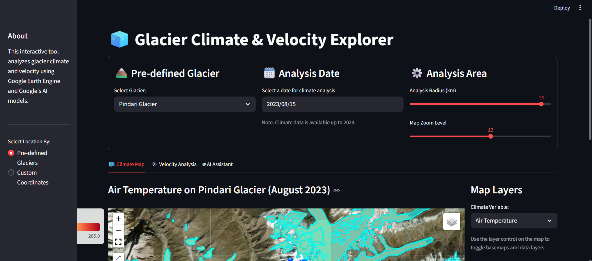
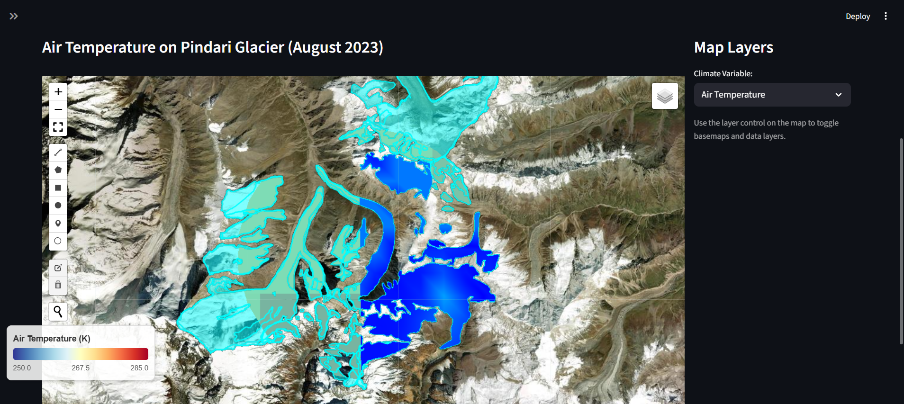
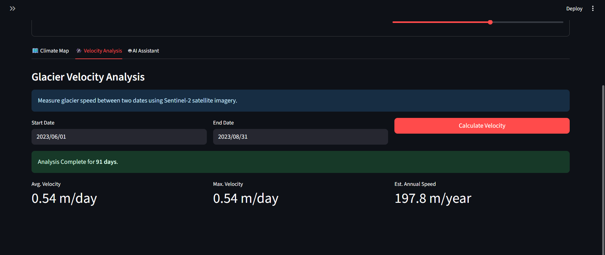
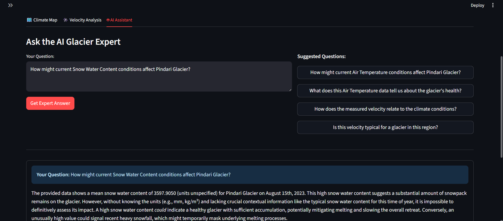

# 🧊 Glacier Climate & Velocity Explorer  

An **interactive desktop laboratory** for the **remote sensing and analysis of cryospheric dynamics**.  
This tool provides a high-level interface for **visualizing climate–glacier interactions**, **quantifying ice surface velocity**, and **leveraging generative AI** for **data-driven scientific inquiry**.  

---

## 📋 Table of Contents  
- [Abstract](#-abstract)  
- [Scientific Motivation & Context](#-scientific-motivation--context)  
- [Core Features & Capabilities](#-core-features--capabilities)  
- [Screenshots](#-screenshots)  
- [Technical Methodology & Architecture](#-technical-methodology--architecture)  
  - [Data Sources](#data-sources)  
  - [System Architecture](#system-architecture)  
  - [Technology Stack](#technology-stack)  
- [Installation & Execution Guide](#-installation--execution-guide)  
  - [Configuration Steps](#configuration-steps)  
  - [Requirements File](#requirements-file)  
  - [Launching the App](#launching-the-app)  
- [Future Research & Development](#-future-research--development)  
- [Project Details](#-project-details)  

---

## 📜 Abstract  

The accelerated retreat of glaciers is a **primary indicator of global climate change**, with profound implications for **sea-level rise** and **regional water resources**.  

The **Glacier Climate & Velocity Explorer** integrates:  
- **Google Earth Engine (GEE)** for petabyte-scale climate & glacier datasets  
- **Sentinel-2 imagery** for velocity tracking  
- **Google Gemini 1.5 Flash** as an **AI-powered scientific assistant**  

This platform enables **interactive visualization**, **quantitative glacier velocity estimation**, and **AI-driven contextual analysis**, democratizing access to advanced cryospheric research for scientists, educators, and policymakers.  

---

## 🔬 Scientific Motivation & Context  

- Glacier health = **Mass Balance**: accumulation (snowfall) – ablation (melt/sublimation)  
- **Air Temperature** drives ablation and meltwater formation  
- **Glacier Velocity** reflects dynamic response (meltwater lubrication → basal sliding → increased ice discharge)  

This tool bridges the gap between **climate drivers** and **glaciological responses**, supporting **research, teaching, and policy planning**.  

---

## ✨ Core Features & Capabilities  

### 🗺️ Climate Map Visualization  
- Multi-variable overlays: **Air Temperature, Rainfall/Snowfall, Snow Depth, SWE**  
- Scientifically validated **color palettes + floating legend**  
- Flexible AOI selection: predefined glaciers or custom coordinates  

### 🛰️ Glacier Velocity Estimation  
- Feature-tracking on **Sentinel-2 Band 8 (10 m)**  
- Velocity between any two dates  
- Metrics: Avg. Velocity, Max Velocity, Estimated Annual Speed  

### 🤖 AI-Powered Assistant  
- Context-aware Q&A via **Google Gemini 1.5 Flash**  
- Synthesizes climate + velocity data into **expert-level explanations**  
- Suggests new scientific questions for guided inquiry  

---

## 📸 Screenshots  

### Main Interface  
  

### Climate Analysis – Air Temperature  
  

### Velocity Analysis Results  
  

### AI Assistant Tab  
  

---

## 🛠️ Technical Methodology & Architecture  

### Data Sources  

| Dataset              | Provider / Source        | Resolution | Use Case                                   |  
|----------------------|--------------------------|------------|--------------------------------------------|  
| **Climate Data**     | NASA FLDAS               | ~11 km     | Temperature, precipitation, snowpack        |  
| **Glacier Boundaries** | GLIMS                  | Variable   | Glacier outlines & masking                  |  
| **Optical Imagery**  | Copernicus Sentinel-2    | 10 m       | Velocity estimation via feature tracking    |  

---

### System Architecture  

- **Frontend (`app.py`)**  
  - Streamlit interface for maps, widgets, and outputs  

- **Backend (`llm_core.py`)**  
  - `GlacierVelocityEngine`: Sentinel-2 velocity analysis in GEE  
  - `GlacierQA`: AI context + Gemini integration  

---

### Technology Stack  

- **Language**: Python 3.9+  
- **Interface**: Streamlit  
- **Geospatial Processing**: Google Earth Engine API  
- **Mapping**: Geemap  
- **AI Assistant**: Google Gemini 1.5 Flash API  
- **Env Management**: python-dotenv  

---

## 🚀 Installation & Execution Guide  

### Configuration Steps  

```bash
git clone https://github.com/your-username/glacier-explorer.git
cd glacier-explorer

# Create virtual environment
python -m venv venv
source venv/bin/activate   # Linux/Mac
.\venv\Scripts\activate    # Windows

# Install dependencies
pip install -r requirements.txt
streamlit
geemap
earthengine-api
google-generativeai
python-dotenv


```
## Authenticate Earth Engine
earthengine authenticate

## Configure API Key
Create a .env file in the project root:
```bash
GOOGLE_API_KEY="YOUR_API_KEY_HERE"
```

## Launching the App
```bash
streamlit run app.py
```

### 🔮 Future Research & Development
---
Time-Series Analysis: Multi-year climate + velocity trends

Mass Balance Modeling: Degree-day & energy-balance models

Multi-Sensor Fusion: Integrate Landsat 8/9 & Sentinel-1 SAR

Advanced Export Options: GeoTIFF/CSV downloads

Educational Mode: Interactive teaching workflows

LLM-Augmented Pipelines: Extend the AI to automate dataset search, preprocessing, and workflow orchestration — aligning with LLM-assisted geospatial analysis research
